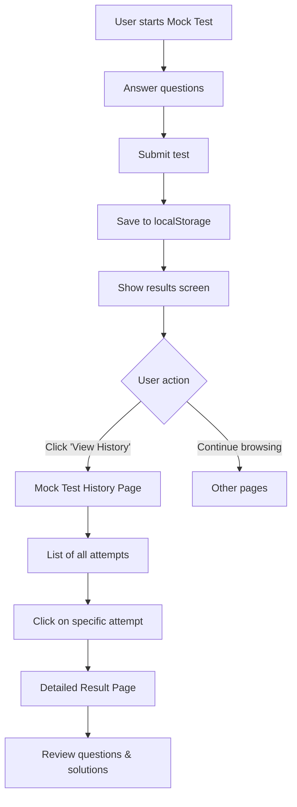

# 📋 Mock Test Attempt Storage - Implementation Plan

## Overview

This document outlines the complete implementation plan for storing mock test attempts in **localStorage** with per-user isolation, allowing users to review their test history and detailed results.

---

## 🎯 Requirements

### User Story

> As a user, I want to store my mock test attempts with all selections and results so that I can review my performance and analyze my mistakes later.

### Key Features

- ✅ Store complete attempt data including all user selections
- ✅ Track time spent per question
- ✅ Preserve question statuses (visited, answered, marked)
- ✅ Per-user storage using Clerk userId
- ✅ View test history with summary statistics
- ✅ Detailed result review with question-by-question analysis
- ✅ Access from main navigation

---

## 📊 Data Structure

### localStorage Key Pattern

```
mockTestAttempts_${userId}
```

### Data Schema

```javascript
{
  userId: "clerk_user_id_here",
  attempts: [
    {
      // Unique identifiers
      attemptId: "uuid-v4-generated",
      testId: "sangam-mock-test",

      // Test metadata
      testTitle: "EXAM ROJGAAR MOCKS",
      testSubtitle: "कर्मण्येवाधिकारस्ते मा फलेषु कदाचन।",
      testCategory: "Hard Challenge Sectional Mocks",

      // Timestamps
      startedAt: "2026-06-07T04:00:00.000Z",
      submittedAt: "2026-06-07T04:03:00.000Z",

      // Summary statistics
      totalQuestions: 50,
      totalAttempted: 25,
      correctCount: 20,
      incorrectCount: 5,
      skippedCount: 25,

      // Performance metrics
      score: 18.35,              // With negative marking (correct * 1 - wrong * 0.33)
      maxScore: 50,
      accuracy: 80.0,            // (correct / attempted) * 100
      rank: 1250,                // Calculated rank
      percentile: 75.5,          // Calculated percentile

      // Time tracking
      totalDurationSec: 180,     // 3 minutes
      timeSpentSec: 165,         // Actual time spent

      // Detailed question-level data
      questionStates: [
        {
          questionId: 1,

          // User interaction
          status: 2,               // 0: Not Visited, 1: Not Answered, 2: Answered, 3: Marked, 4: Answered & Marked
          selectedOption: 2,       // Index of selected option (null if not answered)
          timeSpent: 15,           // Seconds spent on this question

          // Question data (for display)
          questionTextEng: "Who was the famous ruler of the Chera kingdom?",
          questionTextHin: "चेरा राज्य का प्रसिद्ध शासक कौन था?",
          optionsEng: ["Karikala", "Nedunjeral Adan", "Senguttuvan", "Elara"],
          optionsHin: ["करिकाल", "नेडुन्जेरल आदन", "सेंगुट्टुवन", "एलारा"],
          correctAnswer: 2,
          isCorrect: true,

          // Solutions
          solutionEng: "Senguttuvan was the famous ruler of the Chera kingdom...",
          solutionHin: "सेंगुट्टुवन चेरा राज्य का प्रसिद्ध शासक था..."
        },
        // ... more questions
      ]
    },
    // ... more attempts (sorted by submittedAt DESC)
  ]
}
```

---

## 🏗️ Architecture

### File Structure

```
src/
├── utils/
│   └── mockTestStorage.js          # NEW: localStorage utility functions
├── hooks/
│   └── useMockTestAttempts.js      # NEW: React hook for attempts
├── pages/
│   ├── MockTestHistoryPage.jsx     # NEW: List all attempts
│   └── MockTestResultPage.jsx      # NEW: Detailed result view
├── component/
│   ├── MockTest.jsx                # MODIFY: Add save functionality
│   └── Header.jsx                  # MODIFY: Add navigation link
├── data/
│   └── sangamMockData.js           # MODIFY: Add testId field
└── App.jsx                         # MODIFY: Add new routes
```

---

## 🔧 Implementation Details

### 1. Utility Functions (`src/utils/mockTestStorage.js`)

```javascript
/**
 * Save a mock test attempt to localStorage
 * @param {string} userId - Clerk user ID
 * @param {object} attemptData - Complete attempt data
 * @returns {boolean} Success status
 */
export const saveMockTestAttempt = (userId, attemptData) => {
  // Implementation details
};

/**
 * Get all attempts for a user
 * @param {string} userId - Clerk user ID
 * @returns {array} Array of attempts sorted by date
 */
export const getMockTestAttempts = (userId) => {
  // Implementation details
};

/**
 * Get a specific attempt by ID
 * @param {string} userId - Clerk user ID
 * @param {string} attemptId - Attempt ID
 * @returns {object|null} Attempt data or null
 */
export const getMockTestAttemptById = (userId, attemptId) => {
  // Implementation details
};

/**
 * Delete old attempts (keep last 50)
 * @param {string} userId - Clerk user ID
 */
export const cleanupOldAttempts = (userId) => {
  // Implementation details
};

/**
 * Generate unique test identifier
 * @param {object} testData - Test data object
 * @returns {string} Unique test ID
 */
export const generateTestId = (testData) => {
  // Implementation details
};
```

### 2. MockTest Component Updates (`src/component/MockTest.jsx`)

**Changes Required:**

- Import `useUser` from Clerk to get userId
- Import `saveMockTestAttempt` utility
- Update `executeSubmit()` to save attempt data
- Update `handleAutoSubmit()` to save attempt data
- Generate attemptId using uuid
- Transform userState to questionStates format

**Key Code Additions:**

```javascript
import { useUser } from "@clerk/clerk-react";
import { saveMockTestAttempt, generateTestId } from "../utils/mockTestStorage";
import { v4 as uuidv4 } from "uuid";

const MockTest = ({ testData, onComplete }) => {
  const { user } = useUser();

  const executeSubmit = () => {
    recordTime();
    setMockSubmitted(true);
    setShowSubmitPopup(false);
    setCurrentScreen("result");

    const results = calculateResults();

    // Save to localStorage
    if (user?.id) {
      const attemptData = {
        attemptId: uuidv4(),
        testId: generateTestId(testData),
        testTitle: testData.title,
        testSubtitle: testData.subtitle,
        testCategory: testData.category,
        startedAt: new Date(
          Date.now() - (testData.duration * 60 - timeLeft) * 1000,
        ).toISOString(),
        submittedAt: new Date().toISOString(),
        totalQuestions: testData.questions.length,
        totalAttempted: results.attempted,
        correctCount: results.correct,
        incorrectCount: results.wrong,
        skippedCount: testData.questions.length - results.attempted,
        score: parseFloat(results.score),
        maxScore: results.maxScore,
        accuracy: parseFloat(results.accuracy),
        rank: results.rank,
        percentile: parseFloat(results.percentile),
        totalDurationSec: testData.duration * 60,
        timeSpentSec: testData.duration * 60 - timeLeft,
        questionStates: userState.map((state, idx) => ({
          questionId: testData.questions[idx].id,
          status: state.status,
          selectedOption: state.selectedOption,
          timeSpent: state.timeSpent,
          questionTextEng: testData.questions[idx].eng,
          questionTextHin: testData.questions[idx].hin,
          optionsEng: testData.questions[idx].optE,
          optionsHin: testData.questions[idx].optH,
          correctAnswer: testData.questions[idx].ans,
          isCorrect: state.selectedOption === testData.questions[idx].ans,
          solutionEng: testData.questions[idx].solE,
          solutionHin: testData.questions[idx].solH,
        })),
      };

      saveMockTestAttempt(user.id, attemptData);
    }

    if (onComplete) {
      onComplete(results);
    }
  };
};
```

### 3. Mock Test History Page (`src/pages/MockTestHistoryPage.jsx`)

**Purpose:** Display all mock test attempts for the logged-in user

**Features:**

- List all attempts sorted by date (newest first)
- Show summary statistics for each attempt
- Filter by test type/category
- Click to view detailed results
- Responsive design

**UI Components:**

- Header with title "Mock Test History"
- Filter/search bar
- Attempt cards showing:
  - Test title and category
  - Date and time
  - Score and accuracy
  - Rank and percentile
  - "View Details" button

### 4. Mock Test Result Page (`src/pages/MockTestResultPage.jsx`)

**Purpose:** Show detailed results for a specific attempt

**Features:**

- Recreate the result screen from MockTest component
- Display all questions with user's answers
- Show correct answers and solutions
- Highlight correct/incorrect answers
- Show time spent per question
- Filter questions (all/correct/wrong/skipped)

**Route:** `/mock-attempt/:attemptId/result`

### 5. Routes (`src/App.jsx`)

```javascript
{
  path: "mock-test-history",
  element: (
    <ProtectedRoute>
      <MockTestHistoryPage />
    </ProtectedRoute>
  ),
},
{
  path: "mock-attempt/:attemptId/result",
  element: (
    <ProtectedRoute>
      <MockTestResultPage />
    </ProtectedRoute>
  ),
}
```

### 6. Navigation (`src/component/Header.jsx`)

Add link to Mock Test History in the navigation menu:

```javascript
<Link to="/mock-test-history">Mock Test History</Link>
```

---

## 🎨 User Flow



---

## 🛡️ Error Handling

### Storage Quota Exceeded

```javascript
try {
  localStorage.setItem(key, value);
} catch (e) {
  if (e.name === "QuotaExceededError") {
    // Clean up old attempts
    cleanupOldAttempts(userId);
    // Retry save
    localStorage.setItem(key, value);
  }
}
```

### Invalid/Corrupted Data

```javascript
try {
  const data = JSON.parse(localStorage.getItem(key));
  // Validate data structure
  if (!data || !data.attempts || !Array.isArray(data.attempts)) {
    throw new Error("Invalid data structure");
  }
  return data;
} catch (e) {
  console.error("Failed to parse localStorage data:", e);
  return { userId, attempts: [] };
}
```

### Missing User ID

```javascript
if (!user?.id) {
  console.warn("User not authenticated, cannot save attempt");
  return false;
}
```

---

## 📏 Data Management

### Storage Limits

- **localStorage limit:** ~5-10MB per domain
- **Strategy:** Keep last 50 attempts per user
- **Cleanup:** Automatic on each save

### Data Cleanup Function

```javascript
export const cleanupOldAttempts = (userId) => {
  const key = `mockTestAttempts_${userId}`;
  const data = getMockTestAttempts(userId);

  if (data.attempts.length > 50) {
    // Keep only last 50 attempts
    data.attempts = data.attempts
      .sort((a, b) => new Date(b.submittedAt) - new Date(a.submittedAt))
      .slice(0, 50);

    localStorage.setItem(key, JSON.stringify(data));
  }
};
```

---

## ✅ Testing Checklist

### Functional Testing

- [ ] User can complete mock test
- [ ] Attempt is saved to localStorage
- [ ] Attempt appears in history page
- [ ] User can view detailed results
- [ ] All question data is preserved
- [ ] Time tracking is accurate
- [ ] Rank/percentile calculations are correct
- [ ] Solutions display properly
- [ ] Filter functionality works

### Edge Cases

- [ ] Storage quota exceeded handling
- [ ] Corrupted data recovery
- [ ] Missing userId handling
- [ ] Browser clearing localStorage
- [ ] Multiple attempts for same test
- [ ] Concurrent tab handling

### UI/UX Testing

- [ ] Responsive design on mobile
- [ ] Loading states
- [ ] Error messages
- [ ] Navigation flow
- [ ] Back button behavior

---

## 🚀 Implementation Steps

1. ✅ **Planning Phase** - Complete
2. **Create utility functions** - `mockTestStorage.js`
3. **Update MockTest component** - Add save functionality
4. **Create History page** - List all attempts
5. **Create Result page** - Detailed view
6. **Add routes** - Update App.jsx
7. **Update navigation** - Add link in Header
8. **Testing** - Complete flow testing
9. **Edge case handling** - Error scenarios
10. **Documentation** - Update README

---

## 📝 Notes

- **Per-user storage:** Each user's attempts are isolated using their Clerk userId
- **No backend required:** All data stored in browser localStorage
- **Privacy:** Data never leaves the user's device
- **Limitations:** Data is device-specific and will be lost if browser data is cleared
- **Future enhancement:** Could sync to Firestore for cross-device access

---

## 🎯 Success Criteria

✅ User can complete mock test and see results
✅ All attempt data is saved to localStorage
✅ User can view history of all attempts
✅ User can review detailed results with solutions
✅ System handles storage limits gracefully
✅ Works across browser sessions
✅ Per-user data isolation
✅ Responsive UI on all devices

---

**Ready for implementation!** 🚀
